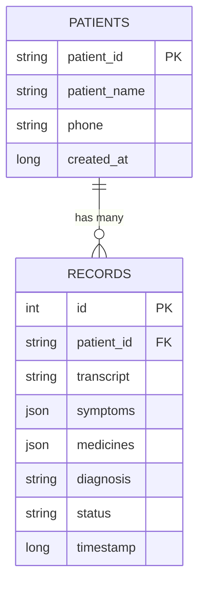

# System Design: Voice Healthcare AI 🏥🎙️

This document outlines the architecture, data flow, and technology stack for the Voice Healthcare Assistant, designed for a professional hackathon submission.

## 1. High-Level Architecture
The application follows a **Modern Client-Server** architecture with an **AI-First Orchestration** layer. It is decoupled into three primary tiers:

- **Frontend (Presentation):** A responsive Vanilla JS/CSS dashboard that handles real-time audio capture, form management, and AI Chat interaction.
- **Backend (Orchestration):** A Node.js Express server that managing API requests, coordinates AI model calls, and handles DB persistence.
- **AI/External Services:** Groq (Whisper/Llama) and Google Gemini for heavy-duty inference.
- **Database:** Local MySQL instance for structured patient data and longitudinal records.

---

## 2. Deep Dive: Core Pipelines

### A. The Audio & Translation Pipeline (Whisper)
1. **Source:** Client captures audio via `MediaRecorder API` (WebM format).
2. **Transmission:** Audio Blob is sent to `/transcribe`.
3. **Inference:** Server forwards the audio to **Groq Whisper-large-v3**.
4. **Translation:** Modeling prompts ensure translation from Hindi/Marathi/Urdu to clinical English occurs at the source.

### B. The Clinical Extraction Pipeline (NLP)
1. **Input:** Raw text (Manual or Transcribed).
2. **Reasoning:** Server calls the LLM (Llama 3.1 or Gemini) with a **System Prompt** designed for medical extraction.
3. **Structuring:** Messy conversation is transformed into a strictly formatted JSON (Symptoms, Duration, Meds, BP, Temp).
4. **Validation:** The server checks for missing clinical fields and returns a "Draft" status to the UI.

### C. The RAG (Retrieval-Augmented Generation) Chatbot
1. **Query:** Doctor asks a question (Voice or Text) in the Chat Widget.
2. **Retrieval:** Server executes a SQL query to fetch all historical visits for the specific `patient_id`.
3. **Augmentation:** The history is injected into a context-aware prompt along with **Today's Date**.
4. **Generation:** The LLM synthesizes an answer based *only* on the retrieved medical facts, preventing hallucinations.

---

## 3. Technology Stack

| Layer | Technology |
| :--- | :--- |
| **Frontend** | HTML5, Vanilla CSS3 (Custom Variables), ES6+ JavaScript |
| **Backend** | Node.js (v18+), Express.js |
| **AI Models** | **Whisper-large-v3** (Audio), **Llama-3.1-8b** (Logic), **Gemini-Pro** (Fallback) |
| **Database** | MySQL (with JSON column support) |
| **Tools** | Multer (File handler), Dotenv (Config), Fetch API |

---

## 4. Data Relationship Diagram (Mermaid)

---

## 5. Security & Demo Readiness
- **Environment Variables:** All API keys and DB credentials are siloed in `.env`.
- **EADDRINUSE Protection:** Server includes auto-kill logic for rapid dev cycles.
- **Error Handling:** Robust validation on both Client and Server to handle API downtime or database locks.

**This system is designed for high accuracy (via Whisper) and high utility (via RAG), meeting the elite standards of medical documentation tools.**
